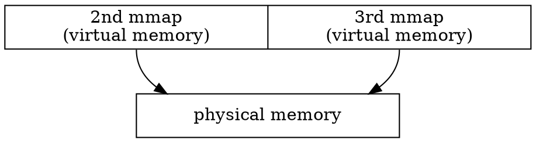

# Ring buffer
contributed by < `StevenChou499` >

## 實驗環境
```shell
$ gcc --version
gcc (Ubuntu 9.4.0-1ubuntu1~20.04) 9.4.0

$ lscpu
Architecture:                    x86_64
CPU op-mode(s):                  32-bit, 64-bit
Byte Order:                      Little Endian
Address sizes:                   39 bits physical, 48 bits virtual
CPU(s):                          4
On-line CPU(s) list:             0-3
Thread(s) per core:              1
Core(s) per socket:              4
Socket(s):                       1
NUMA node(s):                    1
Vendor ID:                       GenuineIntel
CPU family:                      6
Model:                           60
Model name:                      Intel(R) Core(TM) i5-4690 CPU @ 3.50GHz
Stepping:                        3
CPU MHz:                         3500.000
CPU max MHz:                     3900.0000
CPU min MHz:                     800.0000
BogoMIPS:                        6984.02
L1d cache:                       128 KiB
L1i cache:                       128 KiB
L2 cache:                        1 MiB
L3 cache:                        6 MiB
NUMA node0 CPU(s):               0-3
```

## Ring Buffer

Ring buffer 是個固定容量、頭尾相連的緩衝區的資料結構，具有 FIFO 的特性，因此也可以視為一佇列，適合進行資料的快取。透過預先配置固定的容量，加上讀取端的索引與寫入端的索引，讀索引指向下一個緩衝區中可讀的資料，寫索引指向下一個緩衝區可以寫入的位置。在正常的情況下，讀取端只會影響讀取用的索引位置，而寫入方只會影響寫入用的索引位置，因此在只有一位讀取端與寫入端的情況下，只需要確保讀取端不會讀到寫入端尚未寫入的位置即可讓 ring buffer 正常運作。

```c
typedef struct {
    uint8_t *buffer; // real pointer that contains the array
    size_t size; // buffer size
    
    size_t head, tail; // head and tail indices
} queue_t;
```


當寫入端想要寫入環形緩衝區時，需要先確保緩衝區有足夠空間可供寫入，並將想要寫入的資料複製進緩衝區中。
```c
bool put(queue_t *q, uint8_t *data, size_t size)
{
    if (q->tail - q->head > size)
        return false;
    for (size_t i = 0; i < size; i++)
        q->buffer[(q->tail + i) % q->size] = data[i];
    
    q->tail = (q->tail + size) % q->size;
    return true;
}
```

當讀取端想要取出換緩衝區的資料時，也需要先確保緩衝區有資料可以讀取，並將資料從緩衝區複製出來。
```c
bool get(queue_t *q, uint8_t *data, size_t size)
{
    if (q->tail - q->head < size)
        return false;
    for (size_t i = 0; i < size; i++)
        data[i] = q->buffer[(q->head + i) % q->size];
    
    q->head = (q->head + size) % q->size;
    return true;
}
```

## 實際程式碼

為了可以實做出具有基本功能的 ring buffer ，我們可以先利用 `malloc()` 配置一固定大小的環形緩衝區，並且透過寫入端與讀取端兩個執行緒進行。由於會應用到寫入與讀取兩個執行緒， 因此我們需要加上 mutex 以及 condition variables 以確保執行時的正確性。

 * ring buffer 的結構 `queue_t` ：
```c
typedef struct {
    // representing buffer and its size
    uint8_t *buffer;
    size_t size;

    // representing read and write indices
    size_t head, tail;

    // synchronization primitives
    pthread_cond_t readable, writeable;
    pthread_mutex_t lock;
} queue_t;
```

 * 使用 `malloc()` 初始化 ring buffer 的 `queue_init()` ：
```c
/**
 * @brief allocate memory to initialize queue
 * 
 * @param q pointer to the queue itself
 * @param s size of queue
 */
void queue_init(queue_t *q, size_t s)
{
    q->buffer = (uint8_t *)malloc(sizeof(uint8_t) * s);
    q->size = s;
    q->head = q->tail = 0;

    pthread_mutex_init(&q->lock, NULL);
    pthread_cond_init(&q->readable, NULL);
    pthread_cond_init(&q->writeable, NULL);
}
```

 * 移除 ring buffer 空間的 `queue_destroy()` ：
```c
/**
 * @brief free the allocated memory in queue
 * and destroy mutex and condition variables
 * 
 * @param q pointer to the queue itself
 */
void queue_destroy(queue_t *q)
{
    free(q->buffer);
    if (pthread_mutex_destroy(&q->lock) != 0)
        fprintf(stderr, "Could not destroy mutex");

    if (pthread_cond_destroy(&q->readable) != 0)
        fprintf(stderr, "Could not destroy condition variable");

    if (pthread_cond_destroy(&q->writeable) != 0)
        fprintf(stderr, "Could not destroy condition variable");
}
```

 * 搬入資料的 `queue_put()` : 
```c
/**
 * @brief insert the elements in @buffer to queue
 * 
 * @param q pointer to the queue itself
 * @param buffer pointer to the buffer inserting to queue
 * @param size size of the buffer
 */
void queue_put(queue_t *q, uint8_t *buffer, size_t size)
{
    pthread_mutex_lock(&q->lock);

    while ((q->tail + sizeof(size)) % q->size == q->head)
        pthread_cond_wait(&q->writeable, &q->lock);

    memcpy(&q->buffer[q->tail], buffer, sizeof(size_t));
     // printf("put : %ld\n", *(size_t *) buffer);
    q->tail += size;
    q->tail %= q->size;

    pthread_cond_signal(&q->readable);
    pthread_mutex_unlock(&q->lock);
}
```

 * 移出資料的 `queue_get()` : 
```c
/**
 * @brief duplicate the content into the ring buffer
 * 
 * @param q pointer to the queue itself
 * @param buffer pointer to the duplicated content
 * @param max the size of duplicated content
 * @return size_t 
 */
size_t queue_get(queue_t *q, uint8_t *buffer, size_t max)
{
    pthread_mutex_lock(&q->lock);

    while ((q->tail - q->head) == 0)
        pthread_cond_wait(&q->readable, &q->lock);

    memcpy(buffer, &q->buffer[q->head], sizeof(size_t));
    // printf("get : %ld\n", *(size_t *) buffer);
    q->head += max;
    q->head %= q->size;

    pthread_cond_signal(&q->writeable);
    pthread_mutex_unlock(&q->lock);

    return max;
}
```

 * 測試程式碼 `test_dyn.c` ：
```c
#include <stdio.h>
#include <time.h>

#include <unistd.h>

#include "queue_dyn_mem.h"

/**
 * @brief Get timestamp
 * @return timestamp now
 */
uint64_t get_time()
{
    struct timespec ts;
    clock_gettime(0, &ts);
    return (uint64_t)(ts.tv_sec * 1e6 + ts.tv_nsec / 1e3);
}

static void *publisher_loop(void *arg)
{
    queue_t *q = (queue_t *) arg;
    size_t i;
    for (i = 0; i < 65536; i++)
        queue_put(q, (uint8_t *) &i, sizeof(size_t));
    
    return (void *) i;
}

static void *consumer_loop(void *arg)
{
    queue_t *q = (queue_t *) arg;
    size_t count = 0;
    for (size_t i = 0; i < 65536; i++) {
        size_t x;
        queue_get(q, (uint8_t *) &x, sizeof(size_t));
        count++;
        // printf("%ld\n", x);
    }
    return (void *) count;
}

int main()
{
    queue_t q;
    queue_init(&q, (size_t) 4096);

    uint64_t start = get_time();

    pthread_t publisher;
    pthread_t consumer;

    pthread_attr_t attr;
    pthread_attr_init(&attr);

    pthread_create(&publisher, &attr, &publisher_loop, (void *) &q);
    intptr_t sent;
    pthread_create(&consumer, &attr, &consumer_loop, (void *) &q);
    intptr_t recd;
    
    pthread_join(publisher, (void **) &sent);
    pthread_join(consumer, (void **) &recd);

    uint64_t end = get_time();

    printf("\npublisher sent %ld messages\n", sent);
    printf("consumer received %ld messages\n", recd);

    printf("\nTotal runtime : %ldus\n", end - start);

    pthread_attr_destroy(&attr);

    queue_destroy(&q);

    return 0;
}
```

輸出結果：
```bash
1
2
3
...
65533
65534
65535

publisher sent 65536 messages
consumer received 65536 messages

Total runtime : 191566us
```

## 驗證程式
為了能夠檢測該環形緩衝區的運作是否正確且符合 FIFO 的定義，且需要計算執行時間以方便在優化過後比較執行效率，我撰寫了一個測試程式以檢查從環形緩衝區取出的內容是否符合順序。

- [ ] `get_time()`
```c
uint64_t get_time()
{
    struct timespec ts;
    clock_gettime(0, &ts);
    return (uint64_t)(ts.tv_sec * 1e6 + ts.tv_nsec / 1e3);
}
```

- [ ] `verify.py`
```python
#!/usr/bin/python

import sys

# print(sys.argv[1])

result = []
result_split = []

with open(sys.argv[1], 'r') as f:
    tmp = f.readline()
    while (tmp):
        result.append(tmp)
        tmp = f.readline()
    f.close()

result_split = result[0].split()
total = int(result_split[-1]) + 1

for i in range(0, total):
    # print('i =', i, ', result_split[', i, '] =', result_split[i], '\n')
    if(int(i) != int(result_split[i])):
        print('%s failed\n' % str(i))
        print('output: %s' % str(result_split[i]))
        print('expected: %s' % str(i))
        exit()
    
print("for file " + sys.argv[1] + ", everything is correct!")
```

透過在終端機輸入想要檢查的文件名稱，若輸出的結果之順序為正確的，則不會產生任何錯誤訊息，並輸出正確訊息，反之若產生錯誤則會顯示該程式在輸出那一個數值時開始發生錯誤。

## 另一種方法 - 使用 `mmap()` 
由於 `malloc()` 在執行效率上可以再加強，因此我們可以透過 `mmap()` 比較兩者之執行速度。

 * 初始化 ring buffer 的 `queue_init()` : 
```c
void queue_init(queue_t *q, size_t s)
{
    /* We mmap two adjacent pages (in virtual memory) that point to the same
     * physical memory. This lets us optimize memory access, so that we don't
     * need to even worry about wrapping our pointers around until we go
     * through the entire buffer.
     */

    // Check that the requested size is a multiple of a page. If it isn't, we're
    // in trouble.
    if (s % getpagesize() != 0) {
        queue_error(
            "Requested size (%lu) is not a multiple of the page size (%d)", s,
            getpagesize());
    }

    // Create an anonymous file backed by memory
    if ((q->fd = memfd_create("queue_region", 0)) == -1)
        queue_error_errno("Could not obtain anonymous file");

    // Set buffer size
    if (ftruncate(q->fd, s) != 0)
        queue_error_errno("Could not set size of anonymous file");

    // Ask mmap for a good address
    if ((q->buffer = mmap(NULL, 2 * s, PROT_NONE, MAP_PRIVATE | MAP_ANONYMOUS,
                          -1, 0)) == MAP_FAILED)
        queue_error_errno("Could not allocate virtual memory");

    // Mmap first region
    if (mmap(q->buffer, s, PROT_READ | PROT_WRITE, MAP_SHARED | MAP_FIXED,
             q->fd, 0) == MAP_FAILED)
        queue_error_errno("Could not map buffer into virtual memory");

    // Mmap second region, with exact address
    if (mmap(q->buffer + s, s, PROT_READ | PROT_WRITE, MAP_SHARED | MAP_FIXED,
             q->fd, 0) == MAP_FAILED)
        queue_error_errno("Could not map buffer into virtual memory");

    // Initialize synchronization primitives
    if (pthread_mutex_init(&q->lock, NULL) != 0)
        queue_error_errno("Could not initialize mutex");
    if (pthread_cond_init(&q->readable, NULL) != 0)
        queue_error_errno("Could not initialize condition variable");
    if (pthread_cond_init(&q->writeable, NULL) != 0)
        queue_error_errno("Could not initialize condition variable");

    // Initialize remaining members
    q->size = s;
    q->head = q->tail = 0;
    q->head_seq = q->tail_seq = 0;
}
```

先確認所需要配置的 buffer 大小為 page 大小的倍數，接著使用 `memfd_create()` 建立一個只存在在記憶體中的匿名檔案，並沒有實體對應的檔案路徑，接著利用回傳的 fd 傳至 `ftruncate()` 修改該匿名檔案至所需的大小，可以參見 [memfd_create() 的 man page](https://man7.org/linux/man-pages/man2/memfd_create.2.html) ：

> memfd_create() creates an anonymous file and returns a file descriptor that refers to it.  The file behaves like a regular file, and so can be modified, truncated, memory-mapped, and so on. However, unlike a regular file, it lives in RAM and has a volatile backing storage.

在修改完檔案大小後，便是實作快速 ring buffer 的程式碼，首先呼叫 `mmap()` 配置兩倍 buffer 大小的虛擬記憶體，並再呼叫兩次 `mmap()` 配置在第一次的配置的位址，使的前半部與後半部的虛擬記憶體皆映射至同一個 fd ，可以參見 [mmap() 的 man page](https://man7.org/linux/man-pages/man2/mmap.2.html) ：

> > #include <sys/mman.h>
> > void *mmap(void *addr, size_t length, int prot, int flags, int fd, off_t offset);
> 
> mmap() creates a new mapping in the virtual address space of the calling process.  The starting address for the new mapping is specified in addr.  The length argument specifies the length of the mapping (which must be greater than 0).
> 
> mmap() 將一檔案/記憶體內容映射至一特定的虛擬記憶體 (virtual memory) ，並透過對虛擬記憶體的讀取與修改實現對檔案的讀取與修改。
> 
> * `void *addr` : 可以自行指定映射的大概起始位址，若為 NULL 則會由 kernel 自行尋找空間。
> * `size_t length` : 映射的長度。
> * `int prot` : 對於記憶體的保護選項
> > **PROT_EXEC** : pages 可以執行。
> > **PROT_READ** : pages 可以讀取。
> > **PROT_WRITE** : pages 可以寫。
> > **PROT_NONE** : pages 無法被存取。
> 
> * `int flags` : 定義該虛擬記憶體的其他選項。
> > **MAP_SHARED** : 分享該映射，其他的行程對於該映射檔案之的修改是可被看見的。
> > **MAP_PRIVATE** : 使用私有的 COW 映射，該映射檔案的修改內容無法被看見。
> > **MAP_ANONYMOUS** : 該映射不會有相對應的檔案且其內容會全部歸零。有些實作會要求將 fd 改為 -1 。
> > **MAP_FIXED** : 將記憶體位址的映射起始位址定在 addr (該位址必須對齊)，而不是交給作業系統選擇。
> * `int fd` : file descriptor
> 
> 若映射成功，則會回傳映射之起始位址，反之若映射失敗，則會回傳 `(void * -1)` (**MAP_FAILED**)

在設置完虛擬記憶體映射後，最後為了避免 synchronization 的問題，也需要初始化 mutex 與 condition variable 。

 * 刪除 ring buffer 的 `queue_destroy()` : 

```c
void queue_destroy(queue_t *q)
{
    if (munmap(q->buffer + q->size, q->size) != 0)
        queue_error_errno("Could not unmap buffer");

    if (munmap(q->buffer, q->size) != 0)
        queue_error_errno("Could not unmap buffer");

    if (close(q->fd) != 0)
        queue_error_errno("Could not close anonymous file");

    if (pthread_mutex_destroy(&q->lock) != 0)
        queue_error_errno("Could not destroy mutex");

    if (pthread_cond_destroy(&q->readable) != 0)
        queue_error_errno("Could not destroy condition variable");

    if (pthread_cond_destroy(&q->writeable) != 0)
        queue_error_errno("Could not destroy condition variable");
}
```

先移除原先設置好的記憶體映射，並且關閉 fd ，最後再移除 mutex 與 condition variable 。

 * 搬入資料的 `queue_put()` : 

```c
/** Insert into queue *q* a message of *size* bytes from *buffer*
 *
 * Blocks until sufficient space is available in the queue.
 */
void queue_put(queue_t *q, uint8_t *buffer, size_t size)
{
    pthread_mutex_lock(&q->lock);

    // Wait for space to become available
    while ((q->size - (q->tail - q->head)) < (size + sizeof(size_t)))
        pthread_cond_wait(&q->writeable, &q->lock);

    // Write message
    memcpy(&q->buffer[q->tail], buffer, sizeof(size_t));

    // Increment write index
    q->tail += size;

    pthread_cond_signal(&q->readable);
    pthread_mutex_unlock(&q->lock);
}
```

先持有 mutex 並鎖住，檢查是否有足夠空間進行寫入，若有則可以直接寫入，否則會等待並且解鎖與釋放 mutex ，在寫入完成後便會喚醒需要讀取的執行緒，最後再解鎖與釋放 mutex 。

 * 移出資料的 `queue_get()` : 

```c
/** Retrieves a message of at most *max* bytes from queue *q* and writes
 * it to *buffer*.
 *
 * Returns the number of bytes in the written message.
 */
size_t queue_get(queue_t *q, uint8_t *buffer, size_t max)
{
    pthread_mutex_lock(&q->lock);

    // Wait for a message that we can successfully consume to reach the front of
    // the queue
    while ((q->tail - q->head) == 0)
        pthread_cond_wait(&q->readable, &q->lock);

    // Read message body
    memcpy(buffer, &q->buffer[q->head], sizeof(size_t));
    // printf("%ld\n", (size_t) *(size_t *)buffer);

    // Consume the message by incrementing the read pointer
    q->head += max;

    // When read buffer moves into 2nd memory region, we can reset to the 1st
    // region
    if (q->head >= q->size) {
        q->head -= q->size; q->tail -= q->size;
    }

    pthread_cond_signal(&q->writeable);
    pthread_mutex_unlock(&q->lock);

    return max;
}
```

先持有並鎖上 lock ，接著等待是否有資料可以進行讀取，在複製完資料後，必須先檢查拿到的資料是否正確，若資料不正確則需要解鎖並釋放 mutex ，並且重新等待讀取一次。最後更新 `q->head` 並檢查 `q->head` 是否有超出第一次 `mmap()` 的邊界，若有則需要更新 `q->head` 與 `q->tail` 回第一次 `mmap()` 的邊界，否則會造成讀取錯誤。最後再喚醒想要進行寫的執行緒，並解鎖與釋放 mutex 。

### `queue.h` : 

```c
#ifndef queue_h_
#define queue_h_

#include <pthread.h>
#include <stdint.h>

typedef struct {
    // backing buffer and size
    uint8_t *buffer;
    size_t size;

    // backing buffer's memfd descriptor
    int fd;

    // read / write indices
    size_t head, tail;

    // synchronization primitives
    pthread_cond_t readable, writeable;
    pthread_mutex_t lock;
} queue_t;

#include <errno.h>
#include <fcntl.h>
#include <stdarg.h>
#include <stdio.h>
#include <stdlib.h>
#include <string.h>
#include <unistd.h>

#include <sys/mman.h>
#include <sys/types.h>

/* Convenience wrappers for erroring out */
static inline void queue_error(const char *fmt, ...)
{
    va_list args;
    va_start(args, fmt);
    fprintf(stderr, "queue error: ");
    vfprintf(stderr, fmt, args);
    fprintf(stderr, "\n");
    va_end(args);
    abort();
}
static inline void queue_error_errno(const char *fmt, ...)
{
    va_list args;
    va_start(args, fmt);
    fprintf(stderr, "queue error: ");
    vfprintf(stderr, fmt, args);
    fprintf(stderr, " (errno %d)\n", errno);
    va_end(args);
    abort();
}

/** Initialize a blocking queue *q* of size *s* */
void queue_init(queue_t *q, size_t s)
{
    /* We mmap two adjacent pages (in virtual memory) that point to the same
     * physical memory. This lets us optimize memory access, so that we don't
     * need to even worry about wrapping our pointers around until we go
     * through the entire buffer.
     */

    // Check that the requested size is a multiple of a page. If it isn't, we're
    // in trouble.
    if (s % getpagesize() != 0) {
        queue_error(
            "Requested size (%lu) is not a multiple of the page size (%d)", s,
            getpagesize());
    }

    // Create an anonymous file backed by memory
    if ((q->fd = memfd_create("queue_region", 0)) == -1)
        queue_error_errno("Could not obtain anonymous file");

    // Set buffer size
    if (ftruncate(q->fd, s) != 0)
        queue_error_errno("Could not set size of anonymous file");

    // Ask mmap for a good address
    if ((q->buffer = mmap(NULL, 2 * s, PROT_NONE, MAP_PRIVATE | MAP_ANONYMOUS,
                          -1, 0)) == MAP_FAILED)
        queue_error_errno("Could not allocate virtual memory");

    // Mmap first region
    if (mmap(q->buffer, s, PROT_READ | PROT_WRITE, MAP_SHARED | MAP_FIXED,
             q->fd, 0) == MAP_FAILED)
        queue_error_errno("Could not map buffer into virtual memory");

    // Mmap second region, with exact address
    if (mmap(q->buffer + s, s, PROT_READ | PROT_WRITE, MAP_SHARED | MAP_FIXED,
             q->fd, 0) == MAP_FAILED)
        queue_error_errno("Could not map buffer into virtual memory");

    // Initialize synchronization primitives
    if (pthread_mutex_init(&q->lock, NULL) != 0)
        queue_error_errno("Could not initialize mutex");
    if (pthread_cond_init(&q->readable, NULL) != 0)
        queue_error_errno("Could not initialize condition variable");
    if (pthread_cond_init(&q->writeable, NULL) != 0)
        queue_error_errno("Could not initialize condition variable");

    // Initialize remaining members
    q->size = s;
    q->head = q->tail = 0;
}

/** Destroy the blocking queue *q* */
void queue_destroy(queue_t *q)
{
    if (munmap(q->buffer + q->size, q->size) != 0)
        queue_error_errno("Could not unmap buffer");

    if (munmap(q->buffer, q->size) != 0)
        queue_error_errno("Could not unmap buffer");

    if (close(q->fd) != 0)
        queue_error_errno("Could not close anonymous file");

    if (pthread_mutex_destroy(&q->lock) != 0)
        queue_error_errno("Could not destroy mutex");

    if (pthread_cond_destroy(&q->readable) != 0)
        queue_error_errno("Could not destroy condition variable");

    if (pthread_cond_destroy(&q->writeable) != 0)
        queue_error_errno("Could not destroy condition variable");
}

/** Insert into queue *q* a message of *size* bytes from *buffer*
 *
 * Blocks until sufficient space is available in the queue.
 */
void queue_put(queue_t *q, uint8_t *buffer, size_t size)
{
    pthread_mutex_lock(&q->lock);

    // Wait for space to become available
    while ((q->size - (q->tail - q->head)) < (size + sizeof(size_t)))
        pthread_cond_wait(&q->writeable, &q->lock);

    // Write message
    memcpy(&q->buffer[q->tail], buffer, sizeof(size_t));

    // Increment write index
    q->tail += size;

    pthread_cond_signal(&q->readable);
    pthread_mutex_unlock(&q->lock);
}

/** Retrieves a message of at most *max* bytes from queue *q* and writes
 * it to *buffer*.
 *
 * Returns the number of bytes in the written message.
 */
size_t queue_get(queue_t *q, uint8_t *buffer, size_t max)
{
    pthread_mutex_lock(&q->lock);

    // Wait for a message that we can successfully consume to reach
    // the front of the queue
    while ((q->tail - q->head) == 0)
        pthread_cond_wait(&q->readable, &q->lock);

    // Read message body
    memcpy(buffer, &q->buffer[q->head], sizeof(size_t));
    // printf("%ld\n", (size_t) *(size_t *)buffer);

    // Consume the message by incrementing the read pointer
    q->head += max;

    // When read buffer moves into 2nd memory region, we can reset to
    // the 1st region
    if (q->head >= q->size) {
        q->head -= q->size; q->tail -= q->size;
    }

    pthread_cond_signal(&q->writeable);
    pthread_mutex_unlock(&q->lock);

    return max;
}

#endif
```

### `test.c` : 

```c
#include <stdio.h>                         
#include <unistd.h>

#include "queue.h"

#define BUFFER_SIZE (getpagesize())
#define NUM_THREADS (1)
#define MESSAGES_PER_THREAD (getpagesize() * 2)

static void *consumer_loop(void *arg)
{
    queue_t *q = (queue_t *) arg;
    size_t count = 0;
    for (size_t i = 0; i < MESSAGES_PER_THREAD; i++) {
        size_t x;
        queue_get(q, (uint8_t *) &x, sizeof(size_t));
        count++;
    }
    return (void *) count;
}

static void *publisher_loop(void *arg)
{
    queue_t *q = (queue_t *) arg;
    size_t i;
    for (i = 0; i < NUM_THREADS * MESSAGES_PER_THREAD; i++)
        queue_put(q, (uint8_t *) &i, sizeof(size_t));
    return (void *) i;
}

int main(int argc, char *argv[])
{
    queue_t q;
    queue_init(&q, BUFFER_SIZE);

    pthread_t publisher;
    pthread_t consumers[NUM_THREADS];

    pthread_attr_t attr;
    pthread_attr_init(&attr);

    pthread_create(&publisher, &attr, &publisher_loop, (void *) &q);

    for (intptr_t i = 0; i < NUM_THREADS; i++)
        pthread_create(&consumers[i], &attr, &consumer_loop, (void *) &q);

    intptr_t sent;
    pthread_join(publisher, (void **) &sent);
    printf("publisher sent %ld messages\n", sent);

    intptr_t recd[NUM_THREADS];
    for (intptr_t i = 0; i < NUM_THREADS; i++) {
        pthread_join(consumers[i], (void **) &recd[i]);
        printf("consumer %ld received %ld messages\n", i, recd[i]);
    }

    pthread_attr_destroy(&attr);

    queue_destroy(&q);

    return 0;
}
```

該測試程式預設寫只有 1 個執行緒，讀取有 1 個執行緒。並且寫的執行緒一共寫入 65536 個訊息 ，在讀取的執行緒讀取 65536 個訊息 。

編譯上述 `test.c` ：
```bash
$ gcc -Wall -std=c11 -D_GNU_SOURCE -o test test.c -lpthread
```

預期輸出結果：
```
publisher sent 65536 messages
consumer 0 received 65536 messages
```

## 實作原理

原始的 ring buffer 在進行讀取時需要進行模除才能避免讀取到 buffer 外的資料，並且若要讀取的資料會超過 buffer 的尾端，則需要再從 buffer 的開頭繼續讀取，造成許多時間的浪費。

 `queue.h` 使用三次 `mmap()` 以避開上述所及的問題，第一次 `mmap()` 需要配置一個兩倍 buffer 大小的匿名虛擬記憶體，接著第二次 `mmap()` 映射覆蓋第一次映射的前半部份至整個 buffer ，第三次 `mmap()` 則是再將映射覆蓋第一次映射的後半部至整個 buffer 。如此一來在進行 buffer 的存取時就不必擔心會因為讀取的範圍超過實際記憶體的範圍而產生錯誤。



## 比較執行速度

透過執行特定的 shell script 以執行從 100 至 60000 個資料，每次執行 100 次，並且刪除較大以及較小之極端值，計算出平均值行速度後，再利用 gnuplot 繪製比較。

 * 計算 100 至 60000 個資料的腳本 `cnt_time.sh` : 
```bash
#!/bin/bash

rm -f output_dyn
rm -f output

gcc -o test_dyn -pthread test_dyn.c
gcc -o test -pthread test.c

for i in {128..65536..128};
do
    ./test_dyn $i >> output_dyn;
    ./test $i >> output;
done

gnuplot compare.gp
```
透過 for 迴圈以 128 為間隔分別執行 128 個 bytes 至 65536 個 bytes ，並將運算結果重新導入至特定的檔案。

比較結果:


可以看到兩者在執行速度大致上都為 $O(n)$ ，但是使用 `mmap()` 的程式在資料量越來越大時，可以看到執行速度較快於使用 `malloc()` 的程式。

## 加速執行效率 - 引入 `SIZE_OF_MESSAGE` 

在確認執行結果正確無誤後，便可以加速目前的實做，現今的 `queue_put()` 實作為一次移動一個 `size_t` 至 buffer ， `queue_get()` 為從 buffer 移出一個 `size_t` ，因此總共檔案的大小即為所需搬運的次數。我們考慮改為一次搬入/出 10 個 `size_t` ，也就是搬入 buffer 時需要一次搬入 10 個 `size_t` ，搬出時也需要等到 buffer 內有 10 個以上的 `size_t` 才可搬出。以下為實作之程式碼：

```c
#define SIZE_OF_MESSAGE 10ULL
...
size_t in[65536];
size_t out[65536];
...
static void *publisher_loop(void *arg)
{
    rbuf_t *r = (rbuf_t *) arg;
    size_t i;
    size_t **publisher_ptr = malloc(sizeof(size_t *));
    *publisher_ptr = in;
    size_t full_put = (r->messages_per_thread * r->num_threads) / SIZE_OF_MESSAGE;
    size_t remain_put = (r->messages_per_thread * r->num_threads) % SIZE_OF_MESSAGE;
    for (i = 0; i < full_put; i++)
        queue_put(&r->q, (uint8_t **) publisher_ptr, sizeof(size_t) * SIZE_OF_MESSAGE);
    if(remain_put)
        queue_put(&r->q, (uint8_t **) publisher_ptr, sizeof(size_t) * remain_put);
    return (void *) (i * SIZE_OF_MESSAGE + remain_put);
}

static void *consumer_loop(void *arg)
{
    rbuf_t *r = (rbuf_t *) arg;
    size_t i;
    size_t **consumer_ptr = malloc(sizeof(size_t *));
    *consumer_ptr = out;
    size_t full_get = (r->messages_per_thread) / SIZE_OF_MESSAGE;
    size_t remain_get = (r->messages_per_thread) % SIZE_OF_MESSAGE;
    for (i = 0; i < full_get; i++)
        queue_get(&r->q, (uint8_t **) consumer_ptr, sizeof(size_t) * SIZE_OF_MESSAGE);
    if(remain_get)
        queue_get(&r->q, (uint8_t **) consumer_ptr, sizeof(size_t) * remain_get);
    return (void *) (i * SIZE_OF_MESSAGE + remain_get);
}
```


 * 經過修改過後的 `queue_put()` 與 `queue_get()` ：

```diff
-void queue_put(queue_t *q, uint8_t *buffer, size_t size)
+void queue_put(queue_t *q, uint8_t **buffer, size_t size)
{
    pthread_mutex_lock(&q->lock);

    // Wait for space to become available
    while ((q->size - (q->tail - q->head)) < (size + sizeof(size_t)))
        pthread_cond_wait(&q->writeable, &q->lock);

    // Write message
-    memcpy(&q->buffer[q->tail], buffer, size);
+    memcpy(&q->buffer[q->tail], *buffer, size);
    // printf("%ld\n", (size_t) **(size_t **)buffer);

    // Increment write index and buffer index
    q->tail += size;
+    *buffer += size;

    pthread_cond_signal(&q->readable);
    pthread_mutex_unlock(&q->lock);
}

-size_t queue_get(queue_t *q, uint8_t *buffer, size_t size)
+size_t queue_get(queue_t *q, uint8_t **buffer, size_t size)
{
    pthread_mutex_lock(&q->lock);

    // Wait for a message that we can successfully consume to reach the front of
    // the queue
    while ((q->tail - q->head) == 0)
        pthread_cond_wait(&q->readable, &q->lock);

    // Read message body
-    memcpy(buffer, &q->buffer[q->head], size);
+    memcpy(*buffer, &q->buffer[q->head], size);
    // printf("%ld\n", (size_t) *(size_t *)buffer);

    // Consume the message by incrementing the read pointer
    q->head += size;
+    *buffer += size;

    // When read buffer moves into 2nd memory region, we can reset to the 1st
    // region
    if (q->head >= q->size) {
        q->head -= q->size; q->tail -= q->size;
    }

    pthread_cond_signal(&q->writeable);
    pthread_mutex_unlock(&q->lock);

    return size;
}
```

在確認執行結果無誤後，便可以比較執行速度，以下為 `mmap()` 與 `mmap()` 加上 `SIZE_OF_MESSAGE` 為 10 的比較結果：


可以看到比一開始單純使用 `mmap()` 一次傳送一份資料快了相當多，一次搬移多份資料不僅可減少上鎖與解鎖 mutex lock 的次數，也可以減少呼叫函式 `memcpy()` 的次數。此時若我們將 `SIZE_OF_MESSAGE` 改為 50 ，也可以看到執行效率有些許的進步：


 * 接下來為 `SIZE_OF_MESSAGE` 為 50 與 100 的比較：


可以看到，`SIZE_OF_MESSAGE` 為 100 與 50 在傳輸總數量較低的情形下執行效率相當，但是當數量較大時， `SIZE_OF_MESSAGE` 為 100 的執行效率還是稍好。

 * `SIZE_OF_MESSAGE` 為 100 與 200 的比較：


此時一次搬移較多資料並沒有獲得更好的效能，其原因為一次性搬移較多資料會需要耗費相當多的時間，導致另一方想要搬入/出資料時需要等待現在的使用的執行完畢並釋放互斥鎖，才能進入 critical section 並持有互斥鎖。

以下為統整 `SIZE_OF_MESSAGE` 為 1、10、50、100、200、400 的比較圖，可以看到執行效率隨著 `SIZE_OF_MESSAGE` 增加而提高，至 100 時效率為最好，接著又會逐漸下降。


為了增加執行效率，我嘗試觀察 `SIZE_OF_MESSAGE` 為 100 與 500 的實際執行情形，在 `queue_put()` 與 `queue_get()` 加入輸出訊息。

 * `SIZE_OF_MESSAGE` 為 100 的結果：

```bash
$ ./test_con_100
pub 0 time
pub 1 time
pub 2 time
pub 3 time
pub 4 time
pub 5 time
con 0 time
con 1 time
con 2 time
con 3 time
con 4 time
con 5 time
pub 6 time
pub 7 time
pub 8 time
pub 9 time
pub 10 time
con 6 time
con 7 time
con 8 time
con 9 time
con 10 time

...

con 643 time
pub 648 time
pub 649 time
con 644 time
con 645 time
pub 650 time
pub 651 time
con 646 time
con 647 time
pub 652 time
pub 653 time
con 648 time
con 649 time
pub 654 time
pub 655 time
con 650 time
con 651 time
con 652 time
con 653 time
con 654 time
con 655 time
```

 * `SIZE_OF_MESSAGE` 為 500 的結果：

```bash
$ ./test_con_500
pub 0 time
con 0 time
con 1 time
pub 1 time
pub 2 time
con 2 time
con 3 time
pub 3 time
pub 4 time
con 4 time
con 5 time
pub 5 time
pub 6 time
con 6 time
con 7 time
pub 7 time
pub 8 time
con 8 time
con 9 time
pub 9 time
pub 10 time
con 10 time

...

pub 121 time
con 121 time
con 122 time
pub 122 time
pub 123 time
con 123 time
con 124 time
pub 124 time
pub 125 time
con 125 time
pub 126 time
pub 127 time
con 126 time
con 127 time
pub 128 time
pub 129 time
con 128 time
con 129 time
pub 130 time
pub 131 time
con 130 time
con 131 time
```

可以觀察到 publisher/consumer 傾向一次執行多次直到 buffer 填滿/清空觸發 condition wait 為止才會切換至 consumer/publisher 。

接著觀察兩者觸發 condition wait 的次數，首先在結構 `queue_t` 加入 `p_times` 與 `c_times` ，以分別計算進入 `pthread_cond_wait(&q->writeable, &q->lock);` 與 `pthread_cond_wait(&q->readable, &q->lock);` 的次數：

 * `queue_con.h` ：
```diff
typedef struct {
    // backing buffer and size
    uint8_t *buffer;
    size_t size;

    // backing buffer's memfd descriptor
    int fd;

    // read / write indices
    size_t head, tail;

    // synchronization primitives
    pthread_cond_t readable, writeable;
    pthread_mutex_t lock;
+    uint32_t p_times, c_times;
} queue_t;

...

void queue_init(queue_t *q, size_t s)
{
    ...
    
-    q->head = q->tail = 0;
+    q->head = q->tail = q->p_times = q->c_times = 0;
}

...

void queue_put(queue_t *q, uint8_t **buffer, size_t size)
{
    pthread_mutex_lock(&q->lock);

    // Wait for space to become available
    while ((q->size - (q->tail - q->head)) < (size + sizeof(size_t))) {
+        q->p_times++;
        pthread_cond_wait(&q->writeable, &q->lock);
    }

    ...
}

size_t queue_get(queue_t *q, uint8_t **buffer, size_t size)
{
    pthread_mutex_lock(&q->lock);

    // Wait for a message that we can successfully consume to reach
    // the front of the queue
    while ((q->tail - q->head) == 0) {
+        q->c_times++;
        pthread_cond_wait(&q->readable, &q->lock);
    }
    
    ...
}
...
```

以下為其執行結果：
```bash
$ ./test_con_100
average run time = 995us
Average p : 107 times
Average c : 112 times

$ ./test_con_500
average run time = 1146us
Average p : 130 times
Average c : 131 times
```
可以看到兩者遭遇 `pthread_cond_wait()` 的次數是相當的，且 publisher 與 consumer 的次數也非常接近，若加上輸出提示是哪一方無法執行：
```bash
$ ./test_con_100
consumer blocked...
publisher blocked...
consumer blocked...
publisher blocked...
consumer blocked...
publisher blocked...
consumer blocked...
publisher blocked...
consumer blocked...
publisher blocked...
consumer blocked...

...

publisher blocked...
consumer blocked...
publisher blocked...
consumer blocked...
publisher blocked...
consumer blocked...
publisher blocked...
consumer blocked...
publisher blocked...
consumer blocked...
average run time = 6669us
Average p : 122 times
Average c : 123 times


$ ./test_con_500
consumer blocked...
publisher blocked...
consumer blocked...
publisher blocked...
consumer blocked...
publisher blocked...
consumer blocked...
publisher blocked...
consumer blocked...
publisher blocked...
consumer blocked...
publisher blocked...

...

consumer blocked...
publisher blocked...
consumer blocked...
publisher blocked...
consumer blocked...
publisher blocked...
consumer blocked...
publisher blocked...
consumer blocked...
publisher blocked...
consumer blocked...
average run time = 6842us
Average p : 130 times
Average c : 131 times
```

以下為 `SIZE_OF_MESSAGE` 為 100 與 500 的執行結果：


如前述所提及，可以發現執行時大多會一直執行寫入方或是讀取方，直到 buffer 填滿或清空並進入 `pthread_cond_wait()` 後才會切換至另一方執行，導致時間的浪費。

為了避免在實做時 ring buffer 容易因為連續的寫入導致需要切換，接下來實做 ring buffer 的大小對於執行速度的影響。

以下為 ring buffer size 為 8192bytes 的執行速度比較：


可以看到將較於 buffer size 為 4096bytes 時，兩者的執行速度皆有提升，但 `SIZE_OF_MESSAGE` 為 500 的執行速度已經接近 100 的速度了。

以下為 ring buffer size 為 16384bytes 與 32768bytes 的執行速度比較：


從上述兩張圖可以發現， buffer size 的增加對於 `SIZE_OF_MESSAGE` 較大的執行速度提昇相當多，而 `SIZE_OF_MESSAGE` 較小的則提升較不明顯。

以 buffer size 為 32768bytes 為例，以下為兩者的執行結果：
```bash
$ ./test_con_100 b32768
average run time = 765us
Average p : 5 times
Average c : 3 times

$ ./test_con_500 b32768
average run time = 397us
Average p : 9 times
Average c : 14 times
```

可以看到兩者在遭遇 buffer 為滿或是為空的情形下降了，此時 `SIZE_OF_MESSAGE` 為 500 的優勢便顯現出來，其在呼叫 `queue_get()` 、 `queue_put()` 與 `memcpy()` 的次數減少至 $1/5$ 倍，降低呼叫函式的成本，並充分利用 `memcpy()` 施作連續記憶體的優點一次複製大量的內容。

最後為在 buffer size 不同的情況下不同 `SIEZ_OF_MESSAGE` 的執行時間比較：


## 擴展至多執行緒

在實作完 `SIZE_OF_MESSAGE` 的影響後，我們將 `SIZE_OF_MESSAGE` 先設定為 500 ，並可以擴展至多執行緒的實作，將 `r->message_per_thread` 更改至 2 ，試著運行發現有時運行會卡住導致無法結束的情況。在觀察後，發現在進行 `queue_get` 時有其中一個執行緒會優先執行至 `remain_get` 的部份。導致當 buffer size 為 4096 bytes 且 buffer 中有 4000 bytes 時， `queue_get` 取走 (65536 / 2) % 500 = 268 個 message 時，導致 buffer 這時剩下 (4000 - 268 * 8) = 1856 bytes ，這時 `queue_put` 的 `full_get` 尚有 1 次 4000 bytes 尚未存入，且 `queue_get` 其中一執行緒已經執行完畢，剩下之執行緒還有 4000 與 2144 bytes 需要取出。這樣的情形導致 `queue_put` 的大小太導致 buffer 中的剩餘空間搬入後會超過 buffer size ，`queue_get` 的大小也太大導致 buffer 的剩餘數量不夠一次搬出的數量，造成程式運行時會卡住。

以下為導致程式卡住之情形：
```bash
$ ./test_con_500
r.message_per_thread is 32768
buffer_size is 4096
full_get = 65, remain_get = 268
full_put = 131, remain_put = 36
full_get = 65, remain_get = 268

...

queue_put for size = 4000, q->head = 0, q->tail = 0
publisher blocked...
queue_get for size = 4000, q->head = 0, q->tail = 4000
consumer blocked...
queue_put for size = 4000, q->head = 4000, q->tail = 4000
publisher blocked...
queue_get for size = 2144, q->head = 4000, q->tail = 8000
publisher blocked...

```

為了解決上述的問題，需要同步存取方與讀取方在最後進入 `remain_get` 與 `remain_put` 的時間。且在同步化後，也還是有可能會遭遇到上述情形，因此我將 buffer size 可以根據 `message_size` 進行自動的設定大小，以避免過小的 buffer size 導致剩餘的空間不夠作存取。

 * 加入計算 message size ：

```diff
typedef struct {
    // backing buffer and size
    uint8_t *buffer;
    size_t size;

    // backing buffer's memfd descriptor
    int fd;

    // read / write indices
    size_t head, tail;

    // synchronization primitives
    pthread_cond_t readable, writeable;
    pthread_mutex_t lock;
    size_t **consumer_ptr;
    // uint32_t p_times, c_times;

+    // backing message size
+    size_t msg_size;
} queue_t;
```

 * 在 `queue_init()` 時自動計算適當的 buffer 大小：

```diff
void queue_init(queue_t *q, size_t s, size_t m)
{

    ...

+    size_t real_mmap_size;
+    size_t real_mmap = 0;
+    size_t buffer_algin = ((s - 1 + getpagesize()) / getpagesize()) * getpagesize();
+    if(m * sizeof(size_t) * 2 > getpagesize())
+        real_mmap = ((m * 2 * sizeof(size_t) - 1 + getpagesize()) / getpagesize()) * getpagesize();
+    printf("real_mmap = %lu, buffer_algin = %lu\n", real_mmap, buffer_algin);

+    real_mmap_size =  real_mmap > buffer_algin ? real_mmap : buffer_algin;

    ...

    // Initialize remaining members
    q->size = real_mmap_size;
    q->head = q->tail = 0;
+    q->msg_size = m;
    q->consumer_ptr = malloc(sizeof(size_t *));
    if(!q->consumer_ptr)
        fprintf(stderr, "couldn't allocate comsumer pointer\n");
}
```

 * 新增提供同步化功能的 mutex lock ：

```diff
typedef struct {
    queue_t q;
    uint32_t messages_per_thread;
    uint32_t num_threads;
+    pthread_mutex_t barrier;
} rbuf_t;
```

 * 初始化與刪除 ring buffer 的 `rbuf_init()` 與 `rbuf_destroy()` ：

```c
void rbuf_init(rbuf_t *r)
{
    if (pthread_mutex_init(&r->barrier, NULL) != 0)
        fprintf(stderr, "Could not initialize mutex lock");
    r->num_threads = NUM_THREADS;
    r->messages_per_thread = 65536U / NUM_THREADS;
}

void rbuf_destroy(rbuf_t *r)
{
    if (pthread_mutex_destroy(&r->barrier) != 0)
        fprintf(stderr, "Could not destroy mutex lock");
}
```

在 `publisher_loop()` 中為了實做同步化，需要將 `full_get` 在拆分出 `barrier_put` ，需要等待讀取端與存入端皆完成 `full_put` 與 `full_get` 後，存入端執行 `barrier_put` 與 `remain_put` ，而讀取端執行 `remain_get` 即可。

 * 實做完 barrier 的 `publisher_loop()` ：

```c
static void *publisher_loop(void *arg)
{
    ...

    size_t full_put = (r->messages_per_thread * r->num_threads) / SIZE_OF_MESSAGE;
    size_t full_get = (r->messages_per_thread) / SIZE_OF_MESSAGE;
    size_t barrier_put = full_put - r->num_threads * full_get;
    full_put -= barrier_put;
    size_t remain_put = (r->messages_per_thread * r->num_threads) % SIZE_OF_MESSAGE;
    
    pthread_mutex_lock(&r->barrier);
    for (i = 0; i < full_put; i++) {
        queue_put(&r->q, (uint8_t **) publisher_ptr, sizeof(size_t) * SIZE_OF_MESSAGE);
    }
    pthread_mutex_unlock(&r->barrier);
    
    for (i = 0; i < barrier_put; i++) {
        queue_put(&r->q, (uint8_t **) publisher_ptr, sizeof(size_t) * SIZE_OF_MESSAGE);
    }
    if(remain_put)
        queue_put(&r->q, (uint8_t **) publisher_ptr, sizeof(size_t) * remain_put);
    
    return (void *) (i * SIZE_OF_MESSAGE + remain_put);
}
```

 * 實做完 barrier 的 `consumer_loop()` ：

```c
static void *consumer_loop(void *arg)
{
    ...
        
    size_t full_get = (r->messages_per_thread) / SIZE_OF_MESSAGE;
    size_t remain_get = (r->messages_per_thread) % SIZE_OF_MESSAGE;
    
    for (i = 0; i < full_get; i++) {
        queue_get(&r->q, (uint8_t **) r->q.consumer_ptr, sizeof(size_t) * SIZE_OF_MESSAGE);
    }
    
    pthread_mutex_lock(&r->barrier);
    if(remain_get)
        queue_get(&r->q, (uint8_t **) r->q.consumer_ptr, sizeof(size_t) * remain_get);
    pthread_mutex_unlock(&r->barrier);
    
    return (void *) (i * SIZE_OF_MESSAGE + remain_get);
}
```

藉由 mutex lock 可以讓較快執行完成的讀取方執行緒必須等待存入方執行緒完整放入 `full_put` 後並釋放 mutex lock 後，才能開始 `remain_get` 的讀取。

 * 以下為實作結果（2 個讀取執行緒）：
```bash
$ ./test_mul
real_mmap = 8192, buffer_algin = 4096
r.message_per_thread is 32768
buffer_size is 8192
full_get = 65, remain_get = 268
con 0 time
consumer blocked...
full_get = 65, remain_get = 268
con 0 time
consumer blocked...
full_put = 130, remain_put = 36
pub 0 time
queue_put for size = 4000, q->head = 0, q->tail = 0
pub 1 time
queue_put for size = 4000, q->head = 0, q->tail = 4000

...

con 65 time
consumer blocked...
queue_put for size = 4000, q->head = 8096, q->tail = 8096
queue_get for size = 4000, q->head = 8096, q->tail = 12096
pub 131 time
queue_put for size = 4000, q->head = 3904, q->tail = 3904
con 66 time
queue_get for size = 2144, q->head = 3904, q->tail = 7904
pub 132 time
queue_put for size = 288, q->head = 6048, q->tail = 7904
queue_get for size = 2144, q->head = 6048, q->tail = 8192
```

 * 以下為實作結果（4 個讀取執行緒）：
```bash
real_mmap = 8192, buffer_algin = 4096
r.message_per_thread is 16384
buffer_size is 8192
full_get = 32, remain_get = 384
con 1 time
consumer blocked...
full_put = 128, remain_put = 36
pub 1 time
queue_put for size = 4000, q->head = 0, q->tail = 0
full_get = 32, remain_get = 384

...

queue_get for size = 4000, q->head = 96, q->tail = 8096
con 33 time
queue_get for size = 3072, q->head = 4096, q->tail = 8096
queue_put for size = 4000, q->head = 7168, q->tail = 8096
pub 131 time
publisher blocked...
queue_get for size = 3072, q->head = 7168, q->tail = 12096
queue_put for size = 4000, q->head = 2048, q->tail = 3904
pub 132 time
queue_put for size = 288, q->head = 2048, q->tail = 7904
queue_get for size = 3072, q->head = 2048, q->tail = 8192
queue_get for size = 3072, q->head = 5120, q->tail = 8192
```

可以看到在設置 barrier 後，存入方的 `barrier_put` 與 `remain_put` 與讀取方的 `remain_get` 可以同時執行，不會遭遇到 buffer 卡住的問題。

在觀察 pthread 的 man page 時，發現 pthread 有內建的 barrier API ，因此改用 pthread 提供的 `pthread_barrier_init()` 、 `pthread_barrier_wait()` 與 `pthread_barrier_destroy()` 。

 * 修改後的 `rbuf_t` ：

```c
typedef struct {
    queue_t q;
    uint32_t messages_per_thread;
    uint32_t num_threads;
    pthread_barrier_t barrier;
} rbuf_t;
```

 * 修改後的 `rbuf_init()` 與 `rbuf_destroy()` ：


```c
void rbuf_init(rbuf_t *r)
{
    if (pthread_barrier_init(&r->barrier, NULL, NUM_THREADS + 1) != 0)
        fprintf(stderr, "Could not initialize barrier\n");
    r->num_threads = NUM_THREADS;
    r->messages_per_thread = 65536U / NUM_THREADS;
}

void rbuf_destroy(rbuf_t *r)
{
    if (pthread_barrier_destroy(&r->barrier) != 0)
        fprintf(stderr, "Could not destroy barrier\n");
}
```

 * 修改後的 `publisher_loop()` 與 `consumer_loop()` ：

```c
static void *publisher_loop(void *arg)
{
    ...

    for (i = 0; i < full_put; i++) {
        printf("pub %ld time\n", i + 1);
        queue_put(&r->q, (uint8_t **) publisher_ptr, sizeof(size_t) * SIZE_OF_MESSAGE);
    }
    
    pthread_barrier_wait(&r->barrier);

    for (i = 0; i < barrier_put; i++) {
        printf("pub %ld time\n", i + full_put + 1);
        queue_put(&r->q, (uint8_t **) publisher_ptr, sizeof(size_t) * SIZE_OF_MESSAGE);
    }
    
    printf("pub %ld time\n", full_put + barrier_put + 1);
    if(remain_put)
        queue_put(&r->q, (uint8_t **) publisher_ptr, sizeof(size_t) * remain_put);

    return (void *) (i * SIZE_OF_MESSAGE + remain_put);
}

static void *consumer_loop(void *arg)
{
    ...
    
    for (i = 0; i < full_get; i++) {
        printf("con %ld time\n", i + 1);
        queue_get(&r->q, (uint8_t **) r->q.consumer_ptr, sizeof(size_t) * SIZE_OF_MESSAGE);
    }
        
    pthread_barrier_wait(&r->barrier);
    
    printf("con %ld time\n", full_get + 1);
    if(remain_get)
        queue_get(&r->q, (uint8_t **) r->q.consumer_ptr, sizeof(size_t) * remain_get);
 
    return (void *) (i * SIZE_OF_MESSAGE + remain_get);
}
```
